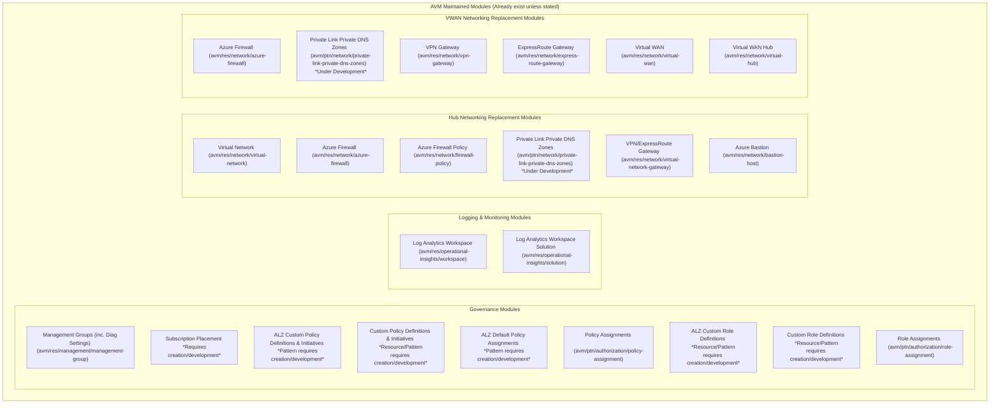

```mermaid
flowchart TD
    subgraph "AVM Maintained Modules (Already exist unless stated)"

        subgraph Governance Modules
            mg["Management Groups (inc. Diag Settings) <br>(avm/res/management/management-group)"]
            subplacement["Subscription Placement <br> *Requires creation/development*"]
            alzpoldef["ALZ Custom Policy Definitions & Initiatives <BR> *Pattern requires creation/development*"]
            ownpoldef["Custom Policy Definitions & Initiatives <BR> *Resource/Pattern requires creation/development*"]
            alzpolasi["ALZ Default Policy Assignments <BR> *Pattern requires creation/development*"]
            ownpolasi["Policy Assignments <BR> (avm/ptn/authorization/policy-assignment)"]
            alzroledef["ALZ Custom Role Definitions <BR> *Resource/Pattern requires creation/development*"]
            ownroledef["Custom Role Definitions <BR> *Resource/Pattern requires creation/development*"]
            roleasi["Role Assignments <BR> (avm/ptn/authorization/role-assignment)"]
        end

        subgraph "Logging & Monitoring Modules"
            law["Log Analytics Workspace <BR> (avm/res/operational-insights/workspace)"]
            lawsol["Log Analytics Workspace Solution <BR> (avm/res/operational-insights/solution)"]
        end

        subgraph Hub Networking Replacement Modules
            vnet["Virtual Network <br> (avm/res/network/virtual-network)"]
            fw["Azure Firewall <br> (avm/res/network/azure-firewall)"]
            fwp["Azure Firewall Policy <br> (avm/res/network/firewall-policy)"]
            pdnszones["Private Link Private DNS Zones <br> (avm/ptn/network/private-link-private-dns-zones) <br> *Under Development*"]
            vng["VPN/ExpressRoute Gateway <br> (avm/res/network/virtual-network-gateway)"]
            bst["Azure Bastion <br> (avm/res/network/bastion-host)"]
        end

        subgraph VWAN Networking Replacement Modules
            vwfw["Azure Firewall <br> (avm/res/network/azure-firewall)"]
            vwpdnszones["Private Link Private DNS Zones <br> (avm/ptn/network/private-link-private-dns-zones) <br> *Under Development*"]
            vwvpnvng["VPN Gateway <br> (avm/res/network/vpn-gateway)"]
            vwexrvng["ExpressRoute Gateway <br> (avm/res/network/express-route-gateway)"]
            vw["Virtual WAN<br> (avm/res/network/virtual-wan)"]
            vwhub["Virtual WAN Hub<br> (avm/res/network/virtual-hub)"]
        end
    end
```
